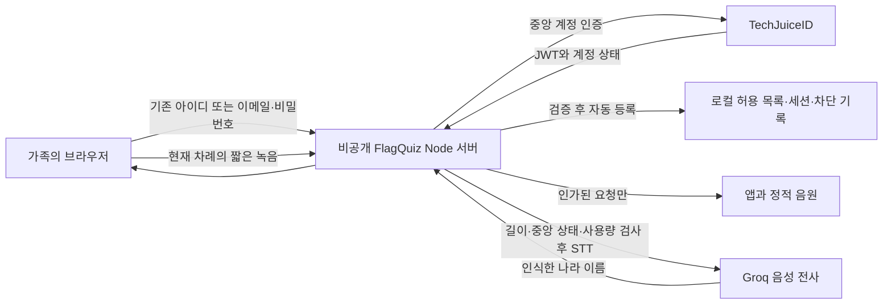

# 나라 이어 말하기와 가족 인증 설계

2026-10-03 기준 FlagQuiz에 나라 이어 말하기와 비공개 서버를 구현했다. 로그인은 기존 TechJuiceID의 아이디 또는 이메일·같은 비밀번호를 사용한다. 중앙 `flagquiz` 앱을 ‘세계 놀이’로 등록하고 기존 활성 계정 17개 모두에 앱 권한을 부여했다(`user` 16개, 기존 TECH 관리자 1개). 비활성·익명 계정은 제외했고 다른 앱 설정은 변경하지 않았다. 현재 차례인 한 사람이 말하고 다음 사람에게 넘긴다. 두 사람이 동시에 말할 때 목소리만으로 화자를 구분하는 기능은 포함하지 않는다.

## 놀이 흐름

1. 설정에 저장된 이름 두 개를 사용한다. 두 번째 이름이 없으면 ‘두 번째 친구’로 표시한다.
2. 질문 없이 전체 194개국 중 하나를 말한다. 한국어 이름·별칭·영문 이름과 말끝을 판정한다.
3. 새 나라면 국기, 대표 좌표, 대륙·지역·수도, 발화자와 순서를 기록하고 바로 상대 차례로 바꾼다.
4. 전체 발화자의 나라를 함께 검사한다. 중복은 이미 말한 사람을 알리고 현재 차례를 유지한다. 모르는 말이나 여러 나라가 들린 경우도 차례를 유지한다.
5. 지도 표식은 실제 좌표에서 옮기지 않는다. 모든 기록을 모으며, 밀집한 나라를 각각 선택할 수 있도록 아래 나라 목록을 제공한다.
6. 읽어주기는 기존 Sua 나라 이름 음원을 사용한다. 지도와 입력을 가리지 않고, 재생이 끝나거나 실패·시간 제한에 걸리면 다음 사람의 듣기를 이어간다. 읽어주기 설정을 존중한다.
7. 화면 숨김·이동·새 판에서 녹음, 네트워크 요청, 읽기, 다음 듣기 예약을 취소한다. 늦은 응답은 새 판을 변경하지 않는다. 기록은 해당 판의 메모리에만 있고 퀴즈 점수·도장·선물 기록을 갱신하지 않는다.

## 서비스 구성

STT는 음성을 글자로 인식하고 TTS는 글을 읽어 준다. 두 사람의 차례는 게임 상태로 구분하며 STT에 화자 분리를 요청하지 않는다. 나라 이름 TTS는 기존 정적 음원을 재사용한다. 전사는 Groq `whisper-large-v3-turbo`, 한국어 `ko`와 짧은 나라 이름 맞춤법 힌트를 사용한다. 요청당 최소 10초·시간당 $0.04이므로 월 3,000회·회당 최대 12초 한도에서 전사 요금은 약 $0.40 이하로 계산된다(무료 크레딧·세금 제외, 2026-10-03 기준). 기존 대한민국 Sua 음원 1.41초를 실제 API로 한 번 전사해 게임의 나라 판정까지 성공했다. 실제 어린이 발화 정확도는 아직 검증하지 않았다. [Groq 공식 음성 전사·요금](https://console.groq.com/docs/speech-to-text).

## 계정과 접근 제한

- 기존 TechJuiceID의 비밀번호를 사용하고 FlagQuiz에 비밀번호를 추가 저장하지 않는다. 기존 7개 앱과 같은 계정을 쓰지만 세션 쿠키를 공유하거나 복사하지 않는다. 중앙 인증에는 공개/anon client key를 사용하며 runtime service-role key를 사용하지 않는다.
- 서버가 중앙 native JWKS로 JWT 서명을 검증하고 issuer·audience·만료·인증된 비익명 role·`tj` 앱 권한·disabled를 확인한다. 중앙 최고 관리자가 아니면 `flagquiz`의 `admin`, `tester`, `user` 권한이 필요하다. 브라우저의 이메일·역할 입력으로 권한을 부여하지 않는다.
- 중앙 검증을 통과한 계정은 로컬에 자동 등록하고 `sub`를 고정한다. 기존 활성 계정 전체의 중앙 앱 권한 부여는 완료했다. 아이디 계정의 합성 이메일도 중앙 계정 식별자로 받으며 Gmail/Workspace 전용 제한을 적용하지 않는다.
- `techjuicelab@gmail.com`은 변경·삭제 불가능한 로컬 SuperAdmin이다. 이 계정만 아이디 또는 이메일을 등록·해제한다. 해제하면 기존 세션을 즉시 지우고 차단 기록을 남겨 중앙 계정의 자동 재등록을 막는다. 다시 추가하면 차단을 해제한다. 다른 중앙 관리자는 이 로컬 관리 권한을 자동으로 얻지 않는다.
- FlagQuiz는 HttpOnly·SameSite=Lax·HTTPS Secure·host-only 세션 쿠키를 발급한다. 만료는 중앙 JWT 만료와 8시간 중 빠른 시점이며 보통 중앙 토큰 수명인 1시간을 넘지 않는다. 중앙 token/refresh token은 쿠키와 영속 저장소에 복사하지 않는다.
- 로컬 허용 목록·세션은 매 요청 확인한다. 중앙 disabled·session generation은 기본 60초 캐시로 확인하고 관리 API와 유료 호출 직전에는 최신 상태를 조회한다. 중앙 계정 상태 조회가 실패하면 해당 접근을 닫고, 비활성화·generation 변경이면 세션을 폐기한다. 변경 요청은 같은 Origin과 CSRF 토큰을 요구한다.
- 기본은 `AUTH_PROVIDER=techjuice-id`, `TJID_GOOGLE_ENABLED=false`다. Google 버튼은 중앙 Google 로그인 실제 검증 전까지 비활성화한다. 앱별 Google client secret이나 Google Cloud callback 추가는 현재 비밀번호 로그인에 필요하지 않다.

## 음성과 저장·백업

원본 녹음을 디스크에 저장하지 않는다. 브라우저가 16kHz·16bit·단일 채널 WAV로 바꿔 보내면 서버가 실제 표본 수로 최대 12초·2MiB를 검증한다. 사용량은 사용자당 UTC 하루 120회, 서비스 전체 UTC 월 3,000회이며 사용자당 동시에 한 요청·전체 네 요청을 허용한다. 유료 호출 전 영속 사용량을 예약하고 실패·취소를 자동 재시도하거나 환불하지 않는다. 최고 관리자도 같은 한도다.

세션 서명 키와 Groq 키는 1Password에서 서버 실행 시 주입한다. `env/private.op.env`는 중앙 연결·세션·Groq의 기존 참조를 사용하며 공개 설정 `PUBLIC_ORIGIN=https://flagquiz.techjuicelab.space`, `STATE_DIR=/var/lib/flagquiz`를 명시한다. 빈 1Password 운영 주소·저장 경로 필드를 채울 필요는 없다. 실제 런타임 주입 검사는 대기 중이며 미해결 `op://` 참조가 남으면 서버 시작을 거절한다. 허용 목록·중앙 계정 연결·차단 기록·세션 generation·사용량은 `_site` 밖의 `access.json`에 저장한다. 원자적 저장·손상 시 접근 차단을 적용하고 SQLite OS guard로 같은 저장 경로의 서버 한 프로세스만 허용한다.

NAS 상태는 `flagquiz-data` volume의 `/var/lib/flagquiz`에 두고 UID/GID `1000:1000`이 관리한다. 상태·백업 파일은 0600, 디렉터리는 0700이다. 별도 백업 작업은 상태 volume을 읽기 전용으로 열고 `flagquiz-backups`의 `/var/backups/flagquiz`에 저장한다. 로그인·Groq 키를 백업에 전달하지 않는다. 일간 14개·일요일 주간 8개·매월 1일 월간 12개를 유지하며, 매 snapshot을 별도 임시 대상에 복원하여 실제 새 프로세스 재시작·쓰기·잠금을 검사한 후 보관한다. 암호화된 NAS 외부 사본은 아직 설정하지 않았다.

## 운영 전환과 현재 확인 상태

배포 구성은 NAS 호스트 포트 `31015`, 컨테이너 내부 `8090`, `cf-web` 네트워크, Node.js 24이다. 외부 후보 주소는 `https://flagquiz.techjuicelab.space`이며 DNS·Cloudflare 연결은 아직 등록하지 않았다. NAS의 Node.js `v24.18.0` SQLite·fetch smoke는 통과했지만 커널 `4.4.302+`는 [Node.js 24 공식 지원 조건](https://github.com/nodejs/node/blob/v24.x/BUILDING.md)의 kernel 4.18 이상을 충족하지 않는다. smoke 결과가 공식 지원이나 운영 완료를 뜻하지 않는다.

현재 GitHub Pages는 이전 공개 버전을 제공한다. 비공개 서버의 실제 로그인·음성·재시작·HTTPS 확인 후 공개 주소를 종료하거나 새 주소로 안내해야 전체 접근 제한 전환이 완료된다. 새 서버는 인증된 앱·음원의 오프라인 캐시를 사용하지 않고 해당 origin의 루트 `/sw.js`와 `flagquiz-` cache만 정리한다. 학습 localStorage는 삭제하지 않는다.

운영 전환에는 다음 확인이 남아 있다.

1. 명시한 운영 origin에 DNS·Cloudflare를 연결하고 기존 중앙 인증·세션·Groq 참조를 해결해 NAS에 배포한다. `/health`의 `configured:true`를 확인하고 실제 로그인은 별도로 시험한다.
2. 기존 아이디·이메일로 최고 관리자와 일반 계정이 접속하는지 확인한다. 중앙 비활성화·generation 변경, 로컬 해제·재등록과 관리자 권한 제한을 검증한다.
3. 서버 재시작 후 허용 목록·차단·사용량이 유지되는지, NAS 일간 백업과 별도 volume 복원이 동작하는지 확인한다. 기본 undeploy로 데이터 volume을 삭제하지 않는다.
4. 외부 HTTPS에서 아이의 짧은 발화, 두 사람의 연속 차례, 지연·중복·읽어주기·수동 입력·마이크 종료를 iPhone/iPad로 확인한다.
5. 이전 공개 주소와 홈 화면 설치를 새 보호 주소로 전환한다.

자동 검사에는 실제 HTTP·JWT 서명·중앙 권한과 장애·Origin/CSRF·만료·해제·자동 등록/차단·원자적 사용량·동시 서버 방지·SIGKILL 복구·별도 대상 백업 복원이 포함된다. 모바일 Chromium에서는 네 나라 기록·한국/대한민국 중복·지도 중심 이동·가로 화면 넘침을 확인했다. 미설정 서버가 앱 JavaScript와 음성 API를 막고 로그인 화면으로 이동하는 것도 로컬 브라우저에서 확인했다.

중앙 앱 등록·기존 활성 계정 권한 부여, 실제 Groq 대한민국 음원 전사와 NAS Node smoke는 확인했다. 실제 TechJuiceID 로그인·외부 HTTPS·운영 배포·어린이 iPhone/iPad 마이크 정확도·지연은 아직 완료로 표시하지 않는다. 실행 설정과 API 계약은 [서버 안내](../server/README.md), 배포와 복구 절차는 [NAS 안내](nas-deploy.md)에 있다.
