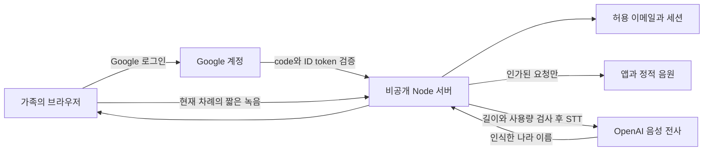

# 나라 이어 말하기와 가족 인증 설계

2026-10-03 기준 구현은 FlagQuiz 저장소에 적용했다. 요청에 등장한 `OpenNoType`가 별도 서비스인지 앱 이름인지 확인 중이며, 다른 저장소와 운영 서비스는 변경하지 않았다. 사용자 상호작용은 **현재 차례인 한 사람이 말하기**로 구현했다. 두 사람이 동시에 대화할 때 목소리만으로 A/B를 구분하는 기능은 포함하지 않는다.

## 놀이 흐름

1. 설정에 저장된 이름 두 개를 사용한다. 두 번째 이름이 없으면 ‘두 번째 친구’로 표시한다.
2. 질문 없이 전체 194개국 중 하나를 말한다. 한국어 이름·별칭·영문 이름과 말끝을 판정한다.
3. 새 나라면 국기, 대표 좌표, 대륙·지역·수도, 발화자와 순서를 기록하고 바로 상대 차례로 바꾼다.
4. 전체 발화자의 나라를 함께 검사한다. 중복은 이미 말한 사람을 알리고 현재 차례를 유지한다. 모르는 말이나 여러 나라가 들린 경우도 차례를 유지한다.
5. 지도 표식은 실제 좌표에서 옮기지 않는다. 모든 기록을 모으며, 밀집한 나라를 각각 선택할 수 있도록 아래 나라 목록을 제공한다.
6. 읽어주기는 기존 Sua 나라 이름 음원을 사용한다. 지도와 입력을 가리지 않고, 재생이 끝나거나 실패·시간 제한에 걸리면 다음 사람의 듣기를 이어간다. 읽어주기 설정을 존중한다.
7. 화면 숨김·이동·새 판에서 녹음, 네트워크 요청, 읽기, 다음 듣기 예약을 취소한다. 늦은 응답은 새 판을 변경하지 않는다. 기록은 해당 판의 메모리에만 있고 퀴즈 점수·도장·선물 기록을 갱신하지 않는다.

## 서비스 구성

STT는 음성을 글자로 인식하고 TTS는 글을 읽어 준다. 두 사람의 차례는 게임 상태로 구분하므로 현재 구현에서는 STT에 화자 분리를 요청하지 않는다. 나라 이름 TTS는 기존 정적 음원을 재사용한다. OpenAI 전사는 서버의 `gpt-4o-mini-transcribe` 어댑터로 연결하고 한국어·나라 이름 힌트를 사용한다. 실제 서비스 연결은 아직 수행하지 않았다. [공식 음성 전사 API](https://developers.openai.com/api/reference/resources/audio/subresources/transcriptions/methods/create).

## 접근과 비용 제한

- 브라우저가 제공한 이메일·역할을 권한으로 사용하지 않는다. Google의 서명과 대상 client, 만료, nonce, verified email을 서버에서 확인한다. 초기 이메일 소유권은 Gmail 또는 검증된 Google Workspace 계정만 수용한다.
- `techjuicelab@gmail.com`은 고정 SuperAdmin이다. 실제 검증된 Google 계정에 연결한 후 관리자만 허용 이메일을 등록·해제한다. 메일 주소 대소문자는 구분하지 않는다. 관리자 지정과 삭제 금지는 서버 정책이다.
- 앱·음원·API는 서버 세션과 현재 허용 목록을 통과해야 제공한다. 인증 쿠키는 HttpOnly·SameSite이며 HTTPS에서는 Secure다. 변경 요청은 같은 Origin과 CSRF 토큰을 요구한다.
- 원본 녹음을 디스크에 저장하지 않는다. 브라우저에서 16kHz 단일 채널 WAV로 바꿔 보내고 서버가 실제 표본 수로 최대 12초를 검증한다.
- 사용자당 하루 120회, 서비스 전체 월 3,000회, 사용자당 동시에 1회·전체 동시에 4회를 제한한다. 유료 호출 전에 영속 사용량을 예약하며 실패·취소를 자동 재시도하지 않는다. 이 한도는 최악의 경우 전체 월 600분의 전사 분량에 해당한다.
- API 키·OAuth secret·세션 서명 키는 1Password에서 서버 실행 시 주입한다. 저장소의 `env/private.op.env`는 아직 연결되지 않은 참조 템플릿이다.
- 서버 상태는 앱 정적 폴더 밖의 영속 디스크에 저장한다. SQLite OS 잠금으로 단일 서버를 보장하고 원자적 저장·손상 시 접근 차단을 사용한다.

## 운영 전환

현재 GitHub Pages는 이전 공개 버전을 계속 제공한다. 새 서버의 실제 로그인과 음성 API 연결이 확인된 뒤 공개 Pages를 종료하거나 보호된 새 주소로 안내해야 전체 접근 제한 전환이 완료된다. 정적 GitHub Pages에 로그인 UI만 추가해 유료 API와 앱 전체가 보호됐다고 간주하지 않는다.

1. 사용할 서버와 HTTPS origin을 정한다. Node 24와 영속 volume을 사용한다. Dockerfile은 이 배포를 위한 구성이고 실제 container build/run은 Docker daemon이 없어 확인하지 못했다.
2. Google Cloud 웹 OAuth client에 `PUBLIC_ORIGIN/api/auth/callback`을 등록한다. 1Password `FlagQuiz Private` 항목에 `google_client_id`, `google_client_secret`, `session_secret`, `openai_api_key`, `public_origin`, `state_directory`를 설정한다. 저장 경로는 절대 경로다.
3. `npm run build`, `npm run start:private`로 실행한다. 서버가 `/health`에 `configured:true`를 반환해야 한다.
4. 실제 SuperAdmin Google 계정으로 로그인하고 가족 이메일을 등록한다. 일반 사용자 접속, 해제한 사용자 재접속 차단, 관리자 권한 제한을 운영 주소에서 확인한다.
5. 아이의 짧은 발화를 실제 API로 확인한다. 한 번의 시작으로 두 사람이 번갈아 이어갈 수 있는지, 지연·중복·읽어주기·수동 입력·마이크 종료를 iPhone/iPad에서 확인한다.
6. 공개 주소와 기존 홈 화면 설치의 전환을 처리한다. 새 보호된 서버는 오프라인 앱 복사본을 저장하지 않으며, 해당 앱의 기존 캐시만 정리한다. 이미 열린 화면의 기록과 학습 localStorage는 삭제하지 않는다.

## 검증 범위

실제 HTTP, RSA 서명 검증, 권한·CSRF·만료·해제, 동일 저장소 동시 실행 방지, SIGKILL 복구, 사용량 원자적 예약, 게임과 클라우드 어댑터 연결을 자동 검사했다. 모바일 Chromium에서 네 나라 기록·한국/대한민국 중복·지도 중심 이동·가로 화면 넘침을 확인했다. 미설정 서버는 앱 JavaScript와 음성 API에 401을 반환하고 로그인 화면으로 이동하는 것을 브라우저에서 확인했다.

실제 Google 계정 로그인, OpenAI 유료 호출, 운영 배포, 실제 iPhone/iPad 마이크 정확도·지연은 아직 검증하지 않았다. 자세한 실행 설정과 API 계약은 [서버 안내](../server/README.md)에 있다.
