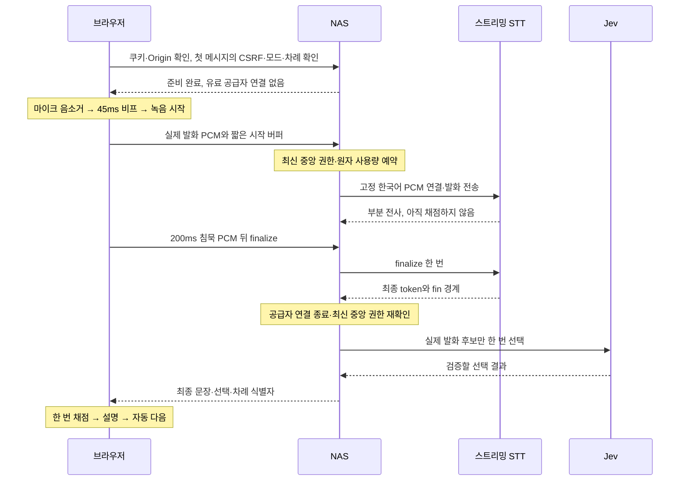

# 말끝 이후 0.5–1초를 위한 스트리밍 설계

2026-10-04 설계안. 현재 운영 코드는 Groq 파일 전사이며, 아래 스트리밍 경로는 아직 구현·배포하지 않았다. 공급자 키 연결과 실제 동일 브라우저 측정 전에는 목표 달성으로 표시하지 않는다.

## 현재 배포와 측정

Forgejo run `585`는 `57810302aa60beb912500fe822e144f921676f9f`를 성공 배포했다. 기존 인증 세션 유지와 운영 주요 JS 5개가 빌드 사본과 같은 내용이며 `no-store`인 것을 확인했다. 작은 준비 비프·200ms 무음 종료·Jev 최종 선택·오답 전체 설명 후 자동 다음이 이 배포에 포함된다.

같은 인증 세션으로 공개 합성 음원 3개를 운영 `/api/speech`에 보냈다. 각 요청은 Groq 전사와 Jev 선택을 한 번씩 사용했다. 세 표본 모두 예상 이름과 `source:jev`를 반환했다.

| 합성 표본 | 모드 | HTTP 왕복 | 권한 확인 | Groq 전사 | 최종 선택 전체 |
| --- | --- | --- | --- | --- | --- |
| 스웨덴 | `voice` | 1,167ms | 37.2ms | 388.3ms | 309.8ms |
| 일본 | `country-chain` | 943ms | 29.2ms | 343.0ms | 255.3ms |
| 스톡홀름 | `capitalVoice` | 1,241ms | 23.4ms | 360.5ms | 289.9ms |

최종 선택 전체에는 선택 직전 중앙 권한 조회가 포함된다. `selection-auth`를 다시 더하지 않는다. 초기 요청 인증·본문 처리·영속 사용량 예약은 위 단계별 수치 밖에 있으므로 HTTP 왕복과 단계 합계의 차이를 전부 네트워크 시간으로 해석하지 않는다.

별도 로컬 Chrome 합성 마이크에서 마지막 말소리부터 전사 요청까지 234ms를 측정했다. 이 값과 위 실제 서버 왕복을 합친 **1.18–1.48초는 추정치**이며 같은 브라우저에서 실제 Jev 응답까지 한 번에 측정한 결과가 아니다. 0.5–1초 목표는 아직 미달이다. 가짜 API 응답을 사용한 235ms 브라우저 결과도 운영 전체 지연으로 사용하지 않는다.

현재 [Groq 공개 ASR](https://console.groq.com/docs/api-reference#create-transcription)은 파일·URL 입력의 최종 전사 방식이다. [16kHz mono와 언어 지정](https://console.groq.com/docs/speech-to-text)은 이미 적용했다. 녹음이 끝난 뒤 전사를 시작하는 순서를 바꾸려면 발화 중 오디오를 처리하는 별도 스트리밍 공급자가 필요하다.

## 공급자와 연결 방식

우선 검토 대상은 한국어를 지원하는 Soniox `stt-rt-v5`다. 공식 실시간 가격의 시간당 환산은 약 $0.12이며 실제 과금은 오디오·입력/출력 텍스트 토큰에 따른다. 짧은 답마다 전체 국가 목록을 context로 보내는 비용은 따로 검토한다. [모델 API](https://soniox.com/docs/api-reference/stt/websocket-api), [한국어 지원](https://soniox.com/docs/stt/concepts/supported-languages), [가격](https://soniox.com/pricing).

브라우저는 같은 origin의 NAS WSS에 접속하고, **장기 공급자 키와 고정 공급자 설정은 서버가 소유**한다. Soniox 직접 임시 키도 가능하지만 TTL은 이미 열린 연결을 종료하지 않고 클라이언트의 모델·context 설정을 고정하지 않는다. 현재 세션·길이·비용 제한을 유지하는 기본안은 NAS 중계다. [임시 키의 실제 제한](https://soniox.com/docs/guides/temporary-api-keys).

Deepgram을 이미 사용 중이면 `nova-3`·`language=ko`를 대안으로 검증한다. Flux의 언어 목록을 한국어 지원으로 오해하지 않으며, 임시 토큰 만료를 열린 스트림의 종료 제한으로 사용하지 않는다. 두 공급자를 한 답에 동시 호출하거나 실패 후 자동 유료 재시도하지 않는다. [Deepgram 모델·언어](https://developers.deepgram.com/docs/models-languages-overview/), [임시 토큰](https://developers.deepgram.com/reference/auth/tokens/grant).

## 한 차례의 처리

1. 로컬 마이크 수명과 유료 upstream 수명을 분리한다. 무음 대기·비프·설명 TTS에는 공급자 연결을 열지 않는다. 지속 말소리 100ms(연속 듣기 150ms)를 확인한 뒤 연결하고, 메모리의 짧은 pre-roll로 첫 음절을 보존한다. 서버도 PCM 길이와 말소리를 검사한다.
2. 준비 비프가 끝나기 전에 오디오를 수집·전송하지 않는다. 마이크를 유지하는 연속 차례에서도 TTS 동안 음소거하고 내부 무음 구간 교체에는 비프를 반복하지 않는다.
3. AudioWorklet에서 16kHz·mono·PCM16 프레임을 작은 묶음으로 전송한다. 44.1/48kHz 입력의 연속 resampling 상태를 보존하며 화면의 부분 전사는 별도 `onPartial`로 표시만 한다. non-final token은 대체하고 final token만 누적한다. 기존 MediaRecorder → WAV 전체 변환은 검증된 파일 전사 경로에 남긴다.
4. 서버만 `wss://stt-rt.soniox.com/transcribe-websocket`에 `stt-rt-v5`, `pcm_s16le`, 16000Hz, 한 채널과 한국어 힌트로 접속한다. 클라이언트가 API 키·모델·prompt·현재 문제 정답을 지정하지 못한다.
5. 200ms 무음은 실제 침묵 PCM을 전송한 뒤 `{"type":"finalize"}`를 한 번 보낸다. `is_final:true`는 일부 token의 확정이며 한 차례 완료가 아니다. 누적 최종 token과 **`<fin>` 경계**가 모두 도착했을 때만 Jev를 실행한다. Soniox `max_endpoint_delay_ms`의 허용 범위는 500–3000ms이므로 그 설정에 `200`을 넣지 않는다. 이 범위가 실제 endpoint 감지의 최소 소요 시간을 뜻하지는 않는다. [manual finalization](https://soniox.com/docs/stt/rt/manual-finalization), [endpoint 설정](https://soniox.com/docs/stt/rt/endpoint-detection).
6. 공급자는 연결 전체 시간을 과금하므로 한 차례 확정·취소·실패 후 바로 닫는다. 다음 사람의 로컬 마이크 재사용이 유료 스트림을 상시 유지하는 뜻은 아니다. [연결과 과금](https://soniox.com/docs/stt/rt/connection-keepalive).
7. 기존 `createAnswerResolver()`를 재사용한다. 실제 발화 후보만 Jev에 전달하고 문제 정답은 기존 브라우저 채점 코드가 비교한다. 답이 없는 부정·인용·미정과 나라 이어 말하기에서 이미 사용한 나라에는 기존 재답변 정책을 유지한다. 같은 이름을 발화 안에서 반복한 경우와 명시적 정정의 최종 답은 기존 인정 규칙을 유지한다.

## 인증·사용량·취소 계약

- 새 WSS에는 세션 쿠키와 정확한 Origin을 검사하고 첫 작은 JSON 메시지에 CSRF를 받는다. 브라우저 WebSocket은 임의 HTTP 헤더를 설정할 수 없으므로 기존 `X-CSRF-Token`을 그대로 사용할 수 있다고 가정하지 않는다. 토큰·키·쿠키를 URL에 넣지 않는다. 첫 인증 메시지 전 오디오와 공급자 호출은 모두 거절한다.
- 유료 연결 직전 최신 중앙 상태와 같은 로컬 세션을 확인하고 기존 영속 쿼터를 먼저 한 번 예약한다. Jev 직전에도 다시 확인한다. 파일 전사와 스트리밍이 **사용자 하루 120회·전체 월 3,000회·사용자 동시 1개·전체 동시 4개**를 공유한다. 최고 관리자도 예외 없이 적용하고 실패·취소 시 예약을 되돌리지 않는다.
- 16kHz PCM의 실제 sample 수로 최대 12초를 제한하고 2MiB·프레임 최대 크기·대기 버퍼·연결 시간 제한을 함께 둔다. 연결만 열어 무한정 슬롯을 점유하는 경우, 느린 업로드, 인증 메시지 없는 연결도 제한한다. 압축 frame은 사용하지 않는다.
- `turnId`·플레이어·세션·화면 세대를 한 요청에 묶는다. 최종 응답을 보내기 직전 같은 로컬 세션과 현재 요청이 아직 유효한지 확인한다. 중복 finalize·중복 `<fin>`·취소 뒤 final·이전 차례 결과는 Jev·채점·선물·자동 다음을 추가 실행하지 않는다. 사용량 주체는 클라이언트 이름이 아닌 서버 세션이다.
- 수동 `stop()`은 실제 발화가 있으면 finalize로 마치고 `cancel()`은 결과를 폐기한다. 부분 전사를 `onResult`로 보내지 않는다. 재생 설명·홈·숨김·새 판·수동 답변·pause는 capture·WSS·공급자·Jev의 취소를 함께 전파한다. `cancel({keepMicrophone:true})`는 작업을 취소한 뒤 음소거한 마이크만 보관하고 일반 `cancel()`은 활성·보관 마이크 모두 종료한다. 연결 장애에는 같은 문제와 남은 시간을 유지하고 수동 재시도·글자 입력을 제공한다. 공급자 실패 후 같은 답을 Groq에 자동으로 다시 보내지 않는다.
- 기존 제한시간은 어댑터의 실제 `recording` 상태에서 흐르며 권한·비프·공급자 대기·최종 선택에는 멈춘다. 이어 말하기의 중복·미해석에는 같은 차례의 명시적 재시도를 유지한다.
- 장기 키는 새 `SONIOX_API_KEY`의 1Password 참조로 서버 실행 시 주입하고 Forgejo 배포 secret 사본을 갱신한다. 원음·전사·키는 앱의 디스크·학습 기록·로그에 저장하지 않는다. 키 미설정·Worklet 미지원은 유료 시도 전에 기존 Groq 경로를 선택한다. 오프라인에는 유료 호출 없이 기존 터치·글자 입력으로 진행한다. Soniox 시작 후 실패는 자동 Groq 재전사로 우회하지 않으며 설정만으로 스트리밍 지원 완료를 표시하지 않는다.

## 구현 대상과 배포 확인

| 대상 | 변경 내용 |
| --- | --- |
| 클라이언트 | 별도 PCM worklet·스트리밍 어댑터, 기존 `start`·`cancel({keepMicrophone:true})`·상태 콜백 계약 유지; `js/speech.js`와 `js/app.js:startCountryChain()`의 생성 경로를 공통 factory로 연결 |
| 서버 | WSS 중계·고정 Soniox 어댑터, 공유 인증·쿼터·동시 슬롯·Jev 해석; 종료 때 browser/upstream 소켓과 Jev를 취소하고 종료 유예 안에 슬롯을 한 번만 해제 |
| 패키지와 Docker | 서버 WebSocket 수용 라이브러리 검토·버전 고정·runtime 의존성 복사; 현재 이미지는 외부 모듈이 없는 구성 |
| 빌드·캐시 | 새 런타임 파일을 loader·build·검사에 포함; NAS는 인증 파일을 `no-store`로 제공; CSP에 검증된 `PUBLIC_ORIGIN`으로 만든 정확한 자체 WSS origin을 허용 |
| Cloudflare | 기존 `flagquiz.techjuicelab.space` → `localhost:31015` 경로에서 실제 HTTP 101·양방향 PCM·단절 검사 |

Cloudflare는 WebSocket 프록시를 지원하지만 연결 후 message의 길이·권한·비용 제한은 NAS가 시행한다. 터널 설정을 완료됐다고 가정하지 않고 현재 외부 도메인의 실제 WSS 연결을 확인한다. [Cloudflare 공식 안내](https://developers.cloudflare.com/network/websockets/).

현재 CSP의 `connect-src 'self'`만으로 모든 브라우저의 WSS 허용을 가정하지 않는다. HTTP 서버의 종료도 upgraded WebSocket을 자동 종료한다고 가정하지 않는다. 새 `SONIOX_API_KEY`는 `readConfig()`의 미해결 `op://` 거절과 Compose 환경 allowlist에 추가하고, 구성 검사에서는 선택한 공급자 준비 상태와 기존 Groq 유지 조건을 함께 확인한다. [CSP 연결 제한](https://developer.mozilla.org/en-US/docs/Web/HTTP/Reference/Headers/Content-Security-Policy/connect-src), [Node 24 종료 계약](https://nodejs.org/docs/latest-v24.x/api/http.html#servercloseallconnections).

출시는 같은 브라우저의 단조시계로 마지막 유효 말소리부터 **실제 최종 답 화면 paint**까지 측정한다. 스트림 준비·부분 전사·provider final·Jev·DOM 적용을 별도 기록하고 네트워크나 서버 시계를 섞어 전체 지연을 만들지 않는다. 합성 PCM과 실물 마이크 결과, cold/warm 연결, 나라·수도·나라 이어 말하기, 정정·반복·작은 목소리의 결과를 구분한다. 부분 전사 표시 시간을 최종 채점 시간으로 보고하지 않는다.

필수 회귀는 `partial A → final B`, token 누적/대체, `<fin>` 중복·늦은 도착, 200ms 침묵 PCM 전송, cancel/finalize 경합, 중앙 권한 회수, UTC 쿼터 경계, 파일/스트림 동시 제한, 무음·40ms click의 유료 호출 0회, TTS 재녹음 금지, 차례·시간 보존, 마지막 결과와 선물 비차단이다. 새 공급자를 실제 연결한 뒤 0.5–1초 결과와 인식 정확도를 함께 확인하기 전에는 완료로 판단하지 않는다.

현재 필요한 외부 정보는 이미 등록한 Soniox 또는 Deepgram의 **서비스·1Password 볼트·항목 이름**이다. 키 값을 대화에 보내지 않는다. 공급자 선택과 키 확인 후 구현·제한 검사·유료 합성 비교·NAS 배포·실제 브라우저 측정을 이어간다.
